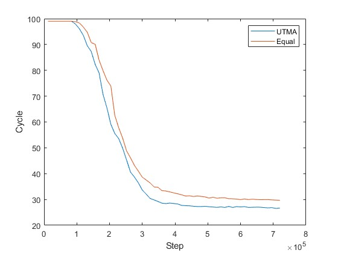
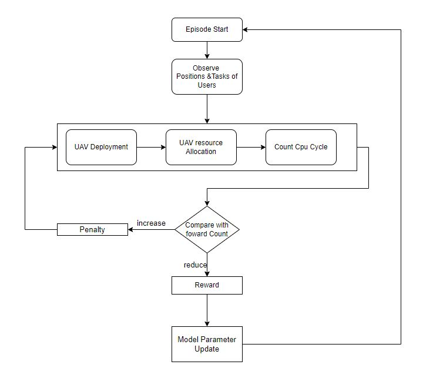

# Optimize Deployment and Minimize Data Processing Time based on Reinforcement learning in UAV MEC environment

## Overview
This is the Simulation code for Optimize Deployment and Minimize Data Processing Time based on Reinforcement learning in UAV MEC environment

With the rapid development of wireless networks and artificial intelligence technologies, various applications of mobile networks have emerged. In particular, resource allocation becomes more complicated and handover problems occur more often when the user's mobility is high, such as the vehicle Internet. In addition, the problem of resource allocation in wireless networks is known as the NP-Hard problem. Using reinforcement learning to solve this problem is a promising solution. However, designing a reward function is very difficult, and incorrect design of the reward function can lead to completely unexpected results. In this paper, we propose a curriculum learning technique to solve the above problems so that reinforcement learning agents can learn more accurately. During learning, each user's mobility was sequentially increased so that the model could learn accurately.

## License
Copyright (c) 2022 Networking Intelligence
Redistribution and use in source and binary forms, with or without modification, are permitted provided that the following conditions are met:

1. Redistributions of source code must retain the above copyright notice, this list of conditions and the following disclaimer.

2. Redistributions in binary form must reproduce the above copyright notice, this list of conditions and the following disclaimer in the documentation and/or other materials provided with the distribution.

THIS SOFTWARE IS PROVIDED BY THE COPYRIGHT HOLDERS AND CONTRIBUTORS "AS IS" AND ANY EXPRESS OR IMPLIED WARRANTIES, INCLUDING, BUT NOT LIMITED TO, THE IMPLIED WARRANTIES OF MERCHANTABILITY AND FITNESS FOR A PARTICULAR PURPOSE ARE DISCLAIMED. IN NO EVENT SHALL THE COPYRIGHT HOLDER OR CONTRIBUTORS BE LIABLE FOR ANY DIRECT, INDIRECT, INCIDENTAL, SPECIAL, EXEMPLARY, OR CONSEQUENTIAL DAMAGES (INCLUDING, BUT NOT LIMITED TO, PROCUREMENT OF SUBSTITUTE GOODS OR SERVICES; LOSS OF USE, DATA, OR PROFITS; OR BUSINESS INTERRUPTION) HOWEVER CAUSED AND ON ANY THEORY OF LIABILITY, WHETHER IN CONTRACT, STRICT LIABILITY, OR TORT (INCLUDING NEGLIGENCE OR OTHERWISE) ARISING IN ANY WAY OUT OF THE USE OF THIS SOFTWARE, EVEN IF ADVISED OF THE POSSIBILITY OF SUCH DAMAGE.
